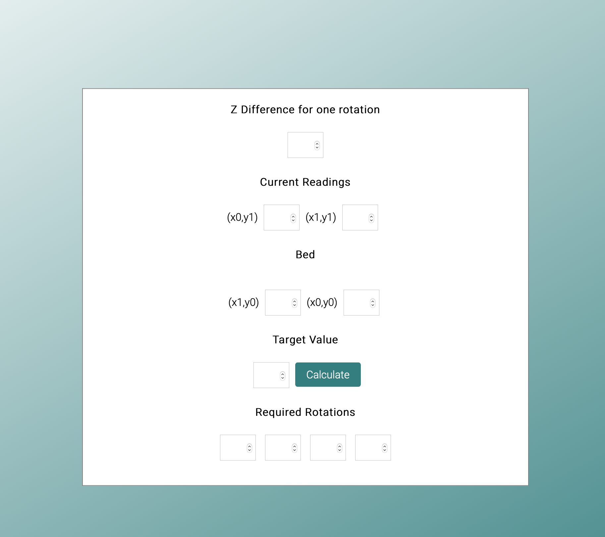

# Calib

**3D bed Calibration tool**

This is a utility that calculates how many rotations are needed in each corner to level the 3D printer build plate.

The constants and calculations are made specifically to [Creality Ender](https://creality3d.shop/collections/3d-printer/products/creality-ender-3-3d-printer-economic-ender-diy-kits-with-resume-printing-function-v-slot-prusa-i3-220x220x250mm?gclid=Cj0KCQiAgomBBhDXARIsAFNyUqMZzzd0juyfJpoB41ypYhovCTDgDWg9gdhJRNO1qfdRs2M-gIhgqLsaAvjIEALw_wcB) 3D printer.

